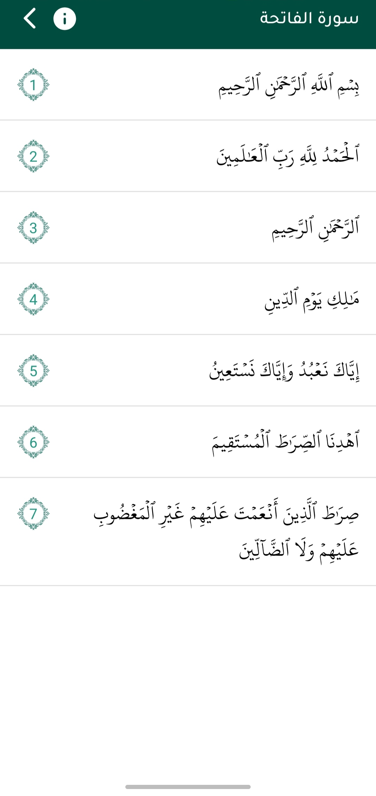

# 📖 Quran App

A modern Quran mobile application designed to provide a simple and comfortable experience for reading and listening to the Holy Quran.

## ✨ Features

- 📖 Read the Holy Quran
- 🎧 Listen to Quran recitations
- 🔎 Browse and navigate between Surahs
- 🎨 Clean and user-friendly interface
- 🌙 Dark mode support
- 📱 Responsive mobile UI
- ⚡ Fast and smooth performance

## 🛠️ Technologies

- Java
- Android
- Firebase
- Git & GitHub

## 📱 Screenshots

  
  
  

## 🚀 Project Goals

The goal of this project is to build a modern and easy-to-use Quran application while improving my Android development skills and learning how to build real-world mobile applications.

## 👨‍💻 Developer

Ahmed

Computer Science Student  
Android & Flutter Developer  
Laravel Backend Developer

---

⭐ If you find this project useful, feel free to star the repository.
